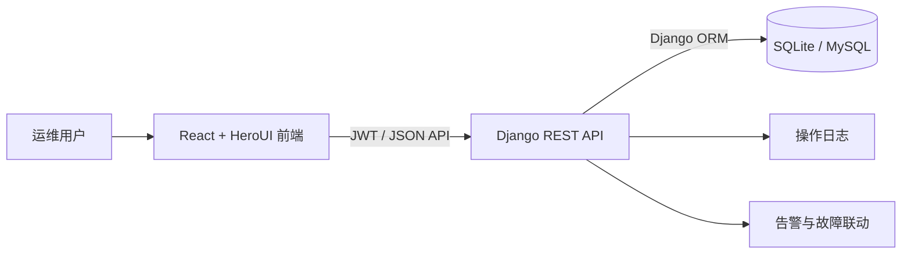
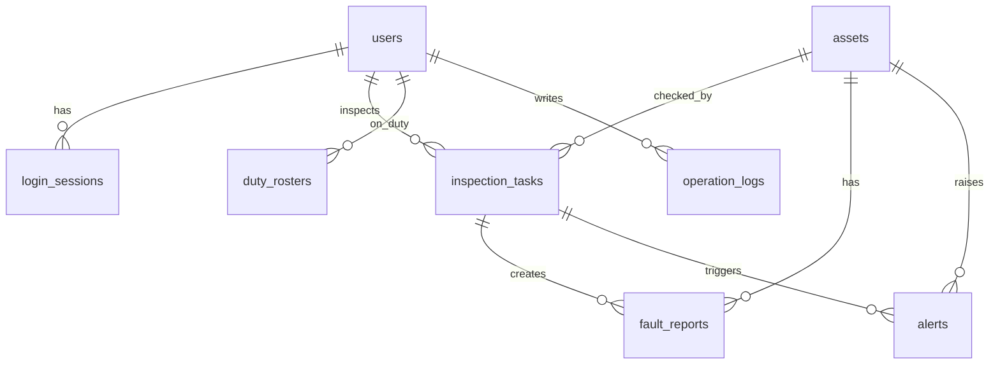

# 运维值班与资产巡检门户

面向运维值班、资产巡检、故障登记与告警处理的一体化门户，让巡检异常从发现、告警、处理到留痕形成可追踪闭环。

## 🛠 技术栈
- Frontend: React 19 + HeroUI + Tailwind CSS + Recharts
- Backend: Django 5 + Django REST Framework + Django ORM
- Database: SQLite by default, optional MySQL through environment variables
- Infra: Single Dockerfile + Gunicorn + Nginx

## 🚀 启动指南 (How to Run)
1. 在本项目的上级目录保留 `Dockerfile` 和 `repo/` 结构。
2. 执行：`docker build -t ops-duty-asset-portal .`
3. 启动：`docker run --rm -p 8080:80 ops-duty-asset-portal`
4. 等待日志出现 `初始化完成：admin / 123456 可登录` 后访问前端。

## 🔗 服务地址 (Services)
- Frontend: http://localhost:8080
- Backend API: http://localhost:8080/api
- Django Admin: http://localhost:8080/admin

## 🧪 测试账号
- Admin: admin / 123456
- 运维工程师: engineer / 123456
- 值班员: duty / 123456
- 查看人员: viewer / 123456

## 🏗️ 系统架构


核心模块包括登录认证、资产台账、巡检任务、故障登记、值班记录、告警通知、统计看板和操作日志。前端所有列表和表单均通过后端 API 真实读写 MySQL，不使用 mock 数据。

## 💾 数据设计


容器默认使用 SQLite，Django ORM 迁移负责创建业务表，启动命令会自动填充演示数据并修正管理员账号。如需连接 MySQL，可设置 `DATABASE_ENGINE=mysql` 以及 `MYSQL_HOST`、`MYSQL_PORT`、`MYSQL_DATABASE`、`MYSQL_USER`、`MYSQL_PASSWORD`。

## 📷 功能介绍
- 登录与身份认证：JWT 会话、登录状态恢复、未登录自动跳转登录页。
- 资产台账管理：资产新增、编辑、查询、状态维护，关联数据删除时返回精准提示。
- 巡检任务管理：接收巡检任务、提交巡检结果，异常巡检自动生成告警和故障记录。
- 故障登记管理：故障严重程度、处理状态、关闭方案和资产状态联动。
- 告警通知管理：告警创建、处理、关闭，并记录操作日志。
- 统计看板：今日巡检数、未处理告警数、值班在线人数、故障关闭率、资产正常率。

## 🔌 接口说明
所有接口统一返回 `{ code, message, data }`。

| 模块 | 方法与路径 | 说明 |
| --- | --- | --- |
| 登录 | `POST /api/auth/login/` | 用户名密码登录 |
| 当前用户 | `GET /api/auth/me/` | 获取当前账号信息 |
| 资产 | `GET/POST/PATCH/DELETE /api/assets/` | 资产台账读写 |
| 巡检 | `GET/POST/PATCH /api/inspection-tasks/` | 巡检任务读写 |
| 提交巡检 | `POST /api/inspection-tasks/{id}/submit/` | 提交正常或异常巡检结果 |
| 故障 | `GET/POST/PATCH /api/fault-reports/` | 故障登记读写 |
| 关闭故障 | `POST /api/fault-reports/{id}/close/` | 写入处理方案并关闭故障 |
| 告警 | `GET/POST/PATCH /api/alerts/` | 告警通知读写 |
| 处理告警 | `POST /api/alerts/{id}/handle/` | 记录告警处理状态 |
| 看板 | `GET /api/dashboard/metrics/` | 获取统计指标 |
| 日志 | `GET /api/operation-logs/` | 查询操作日志 |

## 📁 项目结构
```text
.
├── backend/                # Django 后端项目
│   ├── accounts/           # 用户、JWT、登录会话、初始化账号
│   ├── operations/         # 资产、巡检、故障、值班、告警、日志
│   ├── dashboard/          # 统计看板接口
│   └── portal/             # Django 配置与路由
└── frontend/               # React + HeroUI 前端项目
    ├── src/components/     # 后台壳、表格、弹窗、表单控件
    ├── src/pages/          # 登录页与业务页面
    └── src/lib/            # API 客户端、校验、选项配置
```

## 🔧 Professional Engineering Practices
| 维度 | 已实现内容 |
| --- | --- |
| 日志系统 | 后端使用 Python logging 输出结构化日志，操作日志入库，可通过容器日志查看运行状态 |
| 错误处理 | 后端统一异常响应，前端拦截器按业务消息优先展示，并做 2 秒去重 |
| 数据校验 | 后端 DRF Serializer 校验，前端 Zod 校验，邮箱和手机号支持空值或格式校验 |
| 接口设计 | REST 资源接口 + 业务动作接口，统一响应体和分页格式 |
| 生产级特性 | 单容器一键启动、JWT 鉴权、RBAC 菜单、UTF-8 中文数据、响应式后台界面 |
